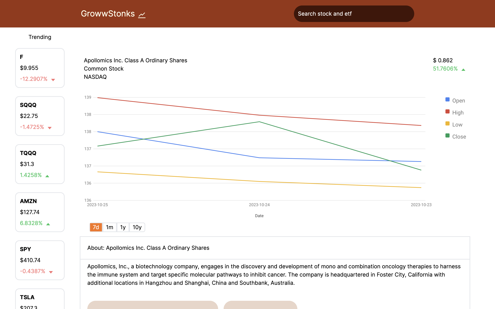
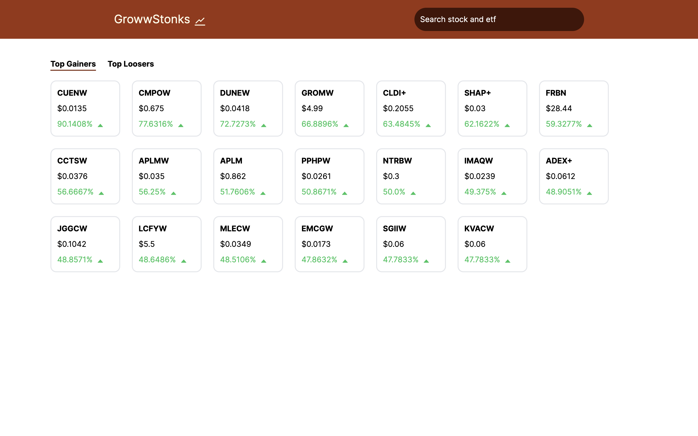
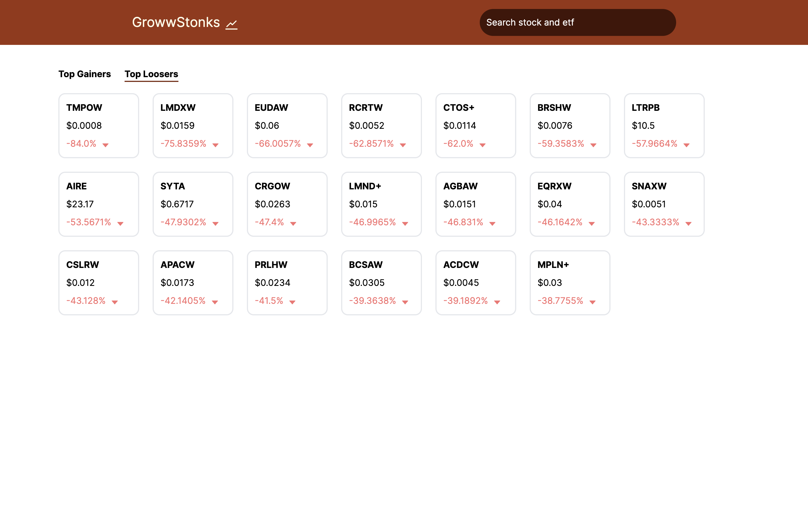
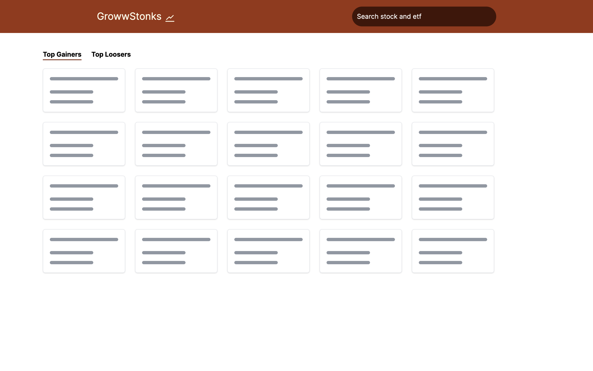

### Internship task for groww.in

### Built With

- Next js
- Typescript
- React query
- Tailwind css
- Radix ui for dialog
- Ant icons
### Folder structure

```
project structure/
├── hooks
│ ├── api - all api calls as react query hook
│ └── all normal react hooks
├── components - all components that are used in more than one page
└── layout - contain all diffrent layout specific code
└── views - contain all page specific components
├── utils - contains all utility functions
└── config - contains envs and end points
├── utils - contains all utility functions
└── pages - all website pages


```

## Project


### Layout structue

 - to prevent repetition of code i have used special type layout structure for each layout when we does this

  ```js
     
Home.Layout = HomeLayout;
export default Home;

  ```

-  in _app.tsx it wraps the code like this

 ```js
      {Component.Layout ? (
          <Component.Layout>
            <Component {...pageProps} />
          </Component.Layout>
            ) : (
          <Component {...pageProps} />
        )}


```

### Bundle size

since the code is only 2 page i have made sure not to use unwanted dependecy , becuase of this the total bundle size is very less

### Server side rendering

- the more info page is loaded via server side rendering , it fetch the company info before the  page is renderd

### Typescript
- code is 100% type defined , this helps for better maintainibilty


### Images







### Prerequisites

You need to install

1. [Node v16](https://nodejs.org/en/)
2. [npm](https://pnpm.io/)

### Installation

1. Clone the repo

   ```sh
   git clone https://github.com/sreehari2003/growwstonks
   ```

2. Install all the NPM packages all the applications.

   ```sh
   npm install
   ```

3. Copy the `.env.example` for each applications to `.env` in the same directory and fill the values required

4. Start the web application dev server and open `http://localhost:3000`

   ```sh
   npm run dev
   ```


## Contributing

Contributions are what make the open source community such an amazing place to learn, inspire, and create. Any contributions you make are **greatly appreciated**.

If you have a suggestion that would make this better, please fork the repo and create a pull request. You can also simply open an issue with the tag "enhancement". Don't forget to give the project a star! Thanks again!

1. Fork the Project
2. Create your Feature Branch (`git checkout -b feature/AmazingFeature`)
3. Commit your Changes (`git commit -m 'Add some AmazingFeature'`)
4. Push to the Branch (`git push origin feature/AmazingFeature`)
5. Open a Pull Request
